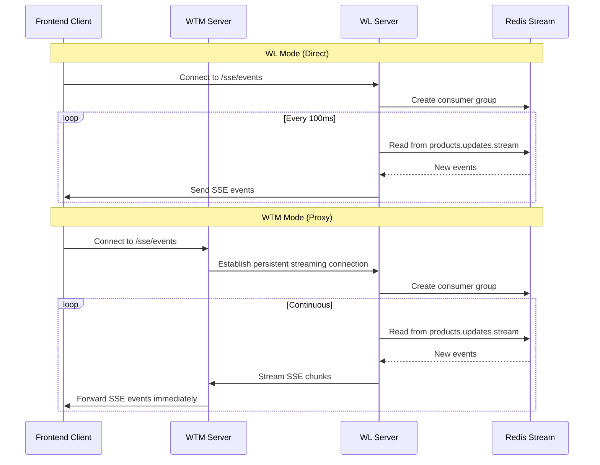
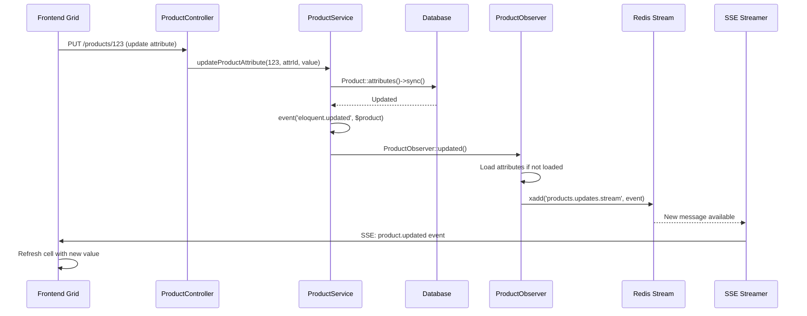

# Product Sync

> **Documentation Version**
> Last Updated: 2025-11-23
> Reference Commit: `1031154`
> Compatible with: ShopSync v1.x

## Overview

Product Sync is a feature that enables two applications to read product data from virtually the same data source. The feature consists of two main components: backend and frontend.

## Frontend

The frontend implementation uses AG Grid to display product data. The grid-related code can be found in the `grid-sync-js` directory.

### Flow

1. The grid is called and rendered by the client
2. Initial data loading:
   - Calls `/products` endpoint to retrieve the list of products
   - Calls `/attributes` endpoint to get all enabled attributes
   - Combines the data and renders the AG Grid table

### Client ID Configuration

The frontend requires a `clientId` configuration when operating in WTM mode:

- **Source**: Passed from the parent application when initializing `ProductSyncGrid`
- **Usage**: Identifies which WL instance's data to fetch in multi-tenant WTM environments
- **Transmission Methods**:
  - HTTP Header: `client-id: {value}`
  - Query Parameter: `?client_id={value}`
- **Flow**: `ProductSyncGrid` → `ProductGridApiClient` → API requests

Reference: `grid-sync-js/src/core/ProductSyncGrid.js:28-38` (commit `1031154`)

### Additional Capabilities

- **Dynamic Filtering**: Additional endpoints are called as needed. For example, when filtering or searching for a brand, the `/brand` endpoint is called
- **Real-time Data Exchange**: The table supports real-time updates via Server-Sent Events (SSE) through the `/sse/events` endpoint. Note that SSE must be supported by the server for this functionality to work
- **CSV Import**: The table can import data from CSV files directly

## Backend

The backend is separated into two modes: **WL** (Whitelabel) and **WTM**.

### Modes

- **WL (Whitelabel)**: The main data source where data is stored
- **WTM**: The admin interface for the SaaS that can access WL's data

**Mode Configuration**: Set via `products-package.mode` config (values: `'wl'` or `'wtm'`, default: `'wl'`)

Reference: `src/Services/Fetchers/ShopInfo/ShopInfoFetcherFactory.php:78` (commit `1031154`)

### Architecture

Both WL and WTM host the same set of endpoints, including:
- `/products`
- `/attributes`
- `/sse/events`
- Additional endpoints (see `routes/api.php` for complete list)

### How It Works

The key difference between the two modes is how they retrieve data:

- **WL Mode**: Retrieves data directly from its own database using Database Fetchers
- **WTM Mode**: Acts as a proxy - requests data from WL first via HTTP API calls using API Fetchers, then relays it to its client

This proxy architecture allows WTM to provide administrative oversight while maintaining a single source of truth in the WL database.

### Authentication Flow

The authentication between WTM and WL works as follows:

1. **WTM generates** an access token for each WL instance it manages
2. **WTM sends** the token to the WL instance (provisioning)
3. **WL stores** the token in their database
4. When **WTM makes API requests** to WL, it includes the token in the `Authorization: Bearer {token}` header
5. **WL validates** the incoming token against what they have stored to authenticate the request

The token is stored encrypted in WTM's database and decrypted when making API calls.

### Implementation Details

#### Factory Pattern

Fetcher factories (e.g., `ProductFetcherFactory`) determine which fetcher to use based on the configured mode:

- **WL Mode**: Returns Database Fetcher instance (e.g., `DatabaseProductFetcher`)
- **WTM Mode**:
  - Requires a request object with `client-id` header
  - Looks up the Client record from the database
  - Returns API Fetcher instance (e.g., `ApiProductFetcher`) initialized with the client's base URL and decrypted access token

This pattern is consistent across all resource types (products, brands, categories, suppliers, attributes, etc.).

#### Data Retrieval Difference

**Database Fetchers (WL Mode)**:
- Use Laravel's Eloquent ORM to query the local database directly
- Build queries with filters and relationships, then execute against local database
- Example: `getAll()` method builds a query and calls `->get()` on it

**API Fetchers (WTM Mode)**:
- Make HTTP requests to WL's API endpoints
- Use the client's base URL and access token for authentication
- Convert JSON API responses back into model instances
- Handle connection errors and timeouts gracefully with fallback values
- Example: `getAll()` method makes HTTP GET request to `/products` endpoint and converts the response

---

## SSE Architecture Deep Dive

### Overview

Server-Sent Events (SSE) enable real-time updates from server to client. The implementation varies significantly between WL and WTM modes.

### DirectSseStreamer (WL Mode)

In WL mode, the server uses `DirectSseStreamer` to push events directly to connected clients:

1. Client connects to `/sse/events`
2. Server creates a Redis consumer group for the session
3. Server continuously reads from Redis stream `products.updates.stream`
4. Events are sent to client in real-time via SSE protocol

Reference: `src/Services/SseStreamers/DirectSseStreamer.php` (commit `1031154`)

### ProxySseStreamer (WTM Mode)

In WTM mode, the server acts as a **persistent proxy** between WL and the frontend client:

1. WTM client connects to WTM's `/sse/events`
2. `ProxySseStreamer` establishes a **persistent HTTP streaming connection** to WL's `/sse/events` endpoint
3. Connection timeout: 600 seconds (10 minutes)
4. WL server streams events to WTM
5. WTM transparently forwards events to its client in real-time

**Key Implementation Details**:
- Uses HTTP streaming with `'stream' => true` option
- Reads 8-byte chunks from WL's response stream
- Buffers until complete SSE messages received (`\n\n` delimiter)
- Forwards messages immediately without transformation
- Tracks connection health via Redis (`sse:active_connections`)
- Disconnects after 3 consecutive failed write attempts

Reference: `src/Services/SseStreamers/ProxySseStreamer.php:165-261` (commit `1031154`)

### SSE Flow Diagram



---

## Data Update & SSE Feedback Flow

### Overview

When product data is updated, the system broadcasts changes to all connected SSE clients for real-time synchronization.

### Update Flow (WL Mode)

1. **User Action**: Frontend user edits a cell in the grid
2. **API Request**: Grid sends PUT request to `/products/{id}` with update data
3. **Controller**: `ProductController::update()` processes the request
4. **Service Layer**:
   - `ProductService::updateProductAttribute()` updates the database
   - For attribute updates: Uses pivot table (`Product::attributes()->sync()`)
5. **Manual Event Firing**:
   - **Critical**: Standard Eloquent events don't fire for pivot updates
   - Code manually triggers: `event('eloquent.updated: ' . get_class($product), $product)`
6. **Observer Hook**: `ProductObserver::updated()` receives the event
7. **Attribute Loading**: Observer ensures attributes are loaded before broadcasting
8. **Redis Stream Push**:
   - Serializes product data (including updated attributes)
   - Pushes to `products.updates.stream` using `Redis::xadd()`
   - Event payload: `{event: 'product.updated', data: {product_id, product, changes, timestamp}}`
9. **SSE Distribution**: `DirectSseStreamer` reads from stream and broadcasts to clients
10. **Frontend Update**: Grid receives SSE event and refreshes affected cells

Reference: `src/Http/Controllers/ProductController.php:164-222`, `src/Services/ProductService.php:251-339`, `src/Observers/ProductObserver.php:33-169` (commit `1031154`)

### Update Flow (WTM Mode)

1-2. Same as WL mode (frontend → WTM controller)
3. **WTM Proxy**: `ApiProductFetcher::update()` makes HTTP PUT request to WL
4-8. Same as WL mode (happens on WL server)
9. **SSE Proxy**: `ProxySseStreamer` receives event from WL's streaming connection
10. **Forward to Client**: Event forwarded transparently to WTM frontend client
11. **Frontend Update**: Grid updates UI

### Why Manual Event Firing?

Pivot table updates (`sync()`, `attach()`, `detach()`) don't trigger Eloquent's `updated` event by design. The manual event firing ensures product updates via attributes still broadcast to SSE clients.

### Update Flow Diagram



---

## Error Handling Strategy

### Philosophy

The system follows a **"fail-soft"** approach in WTM mode: connection failures return empty/null values rather than throwing exceptions, preventing UI crashes while logging errors for monitoring.

### API Fetcher Error Handler

All API calls in WTM mode go through `ApiProductFetcher::handleRequest()` which catches:

- `ConnectionException`: Network timeouts or connection failures
- `RequestException`: HTTP errors (4xx, 5xx responses)
- Generic `Exception`: Unexpected errors

When errors occur, the method returns a **default fallback value** instead of throwing exceptions.

Reference: `src/Services/Fetchers/Product/ApiProductFetcher.php:71-103` (commit `1031154`)

### Default Fallback Values

| Method | Fallback Value | Frontend Impact |
|--------|----------------|-----------------|
| `getAll()` | `['data' => []]` | Grid displays "No products found" |
| `paginate()` | Empty pagination with `total: 0` | Grid shows page 1 of 1 with 0 items |
| `find()` | `null` | Product not found (404-like behavior) |
| `create()` | `null` | Creation fails silently |
| `update()` | `null` | Update fails silently |
| `delete()` | `null` → `false` | Delete operation failed |
| `search()` | `['data' => []]` | Search returns no results |
| `exportToCsv()` | `''` (empty string) | Empty CSV file downloaded |
| `importFromCsv()` | `['imported' => 0, 'errors' => ['API import failed']]` | Shows error message to user |

### Configuration

**Timeout Setting**: Configurable via `products-package.wtm_api_timeout` (default: 5 seconds)

**Health Check**: `ApiProductFetcher::isAvailable()` can be called proactively to check WL connectivity before making data requests (uses 2-second timeout)

### User Experience Implications

**Scenario: WL Server Down**
- User opens WTM product grid
- Connection timeout after 5 seconds
- Grid displays empty table
- **User sees**: "No products found" (can't distinguish from genuinely empty data)
- **Logs show**: "WTM API timeout or connection error"

**Recommendation**: Implement UI indicators that call `isAvailable()` to warn users when operating in degraded mode.

### What It Doesn't Do

- ❌ **No caching**: Doesn't return stale data from previous successful requests
- ❌ **No retry logic**: Single attempt only (no automatic retries)
- ❌ **No circuit breaker**: Doesn't prevent repeated calls to failed endpoints
- ❌ **No partial data**: Returns empty instead of partial results

---

## CSV Import Security & Validation

### Overview

CSV import includes multiple security layers to prevent malicious file uploads and data injection attacks.

Reference: `src/Http/Controllers/ProductController.php:463-726`, `src/Services/Fetchers/Product/DatabaseProductFetcher.php:299-398` (commit `1031154`)

### Security Validation Layers

#### 1. File Upload Validation

```
- File type: Only 'csv' and 'txt' extensions allowed
- MIME type: Content-based detection (not just extension check)
- File size: Maximum 2MB
- Malicious signatures: Blocks ELF, PE, ZIP, PDF, image headers
```

#### 2. Content Pattern Detection

Blocks files containing:
- PHP code: `<?php`
- JavaScript: `<script>`, `javascript:`
- SQL injection attempts
- Excel formula injection: `=CALL`, `=CMD|`

#### 3. CSV Structure Validation

- **Line length limit**: 10,000 characters per line
- **Total lines limit**: 50,000 rows maximum
- **Header validation**: Must contain at least 2 columns
- **Expected headers**: Validates against required column names

### Import Processing

#### Header Validation

Expected columns (19 total):
```
Product Name, SKU Prefix, SKU Value, SKU Custom Ref,
Product Status, Sell Status, Purchase Date, Current Price,
Sale Price, Trade Price, VAT Scheme, Description,
Category, Brand, Supplier, SEO Title, SEO Keywords,
SEO Description, URL Slug
```

Missing headers cause import to fail with specific error message.

#### Row Processing

1. **UTF-8 BOM Handling**: Removes byte-order marks
2. **Empty Row Skipping**: Ignores rows with <2 columns or empty product name
3. **Data Mapping**: Maps CSV columns to database columns using `ProductImportMappings`
4. **Upsert Logic**: Uses `updateOrCreate()` with unique key:
   - Primary key: `sku_prefix` + `rol_number` (if both present)
   - Fallback key: `name`
5. **Transaction Safety**: Wrapped in database transaction (all-or-nothing)

#### Performance Optimization

**Events Disabled During Import**:
```php
Product::withoutEvents(function () use ($uniqueKey, $productData) {
    Product::updateOrCreate($uniqueKey, $productData);
});
```

This prevents firing N individual SSE broadcasts during bulk import (which would overwhelm clients).

**Single Import Event**: After completion, fires one `ProductObserver::imported()` event to notify clients that a bulk import occurred.

### Import Response

Returns:
```json
{
  "message": "Import completed",
  "imported": 150,
  "errors": [
    "Row 5: Product name required",
    "Row 12: Invalid status value"
  ]
}
```

### Security Trade-offs

- ✅ **Prevents**: Code injection, malware uploads, formula injection
- ✅ **Validates**: File structure, data format, required fields
- ⚠️ **Doesn't validate**: Business logic (e.g., duplicate SKUs across categories)
- ⚠️ **Performance**: Large files (near 50K rows) may hit PHP memory/execution limits
